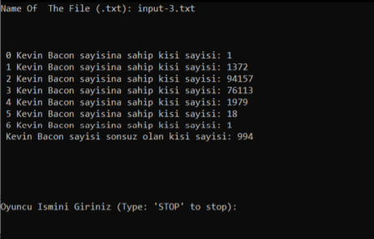
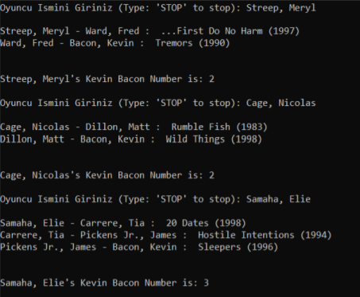

# Kevin Bacon Number

Six Degrees of Kevin Bacon or Bacon's Law is a parlor game where players challenge each other to arbitrarily choose an actor and then connect them to another actor via a film that both actors have appeared in together, repeating this process to try and find the shortest path that ultimately leads to prolific American actor Kevin Bacon. It rests on the assumption that anyone involved in the Hollywood film industry can be linked through their film roles to Bacon within six steps. The game's name is a reference to "six degrees of separation", a concept which posits that any two people on Earth are six or fewer acquaintance links apart.

According to Bacon's Law, Kevin Bacon Number of an actor is the distance between that actor and Kevin Bacon. For example, Arnold Schwarzenegger and Kevin Bacon have never acted in the same movie before. However, Arnold Schwarzenegger and  Stephen Furst acted in the same movie named Scavenger Hunt. Also, Stephen Furst and Kevin Bacon acted in the movie named Animal House together. Therefore, Kevin Bacon Number of Arnold Schwarzenegger is 2.

# Algorithm

To find the distance between Kevin Bacon and an actor given by the user, I used a database in text format. In this text file, every row has a movie, and actors acted in that movie. 
I created a graph by parsing this text file and used BFS (Breadth-First Search) algorithm to find the distance.

# Usage

First, you need to give the name of the text file of the database. After that, program creates a graph with the information given and show how many actors exist at distances from 1 to 6.

Program asks for actor names to find Kevin Bacon Number and show how that actor connects to Kevin Bacon with movies.

